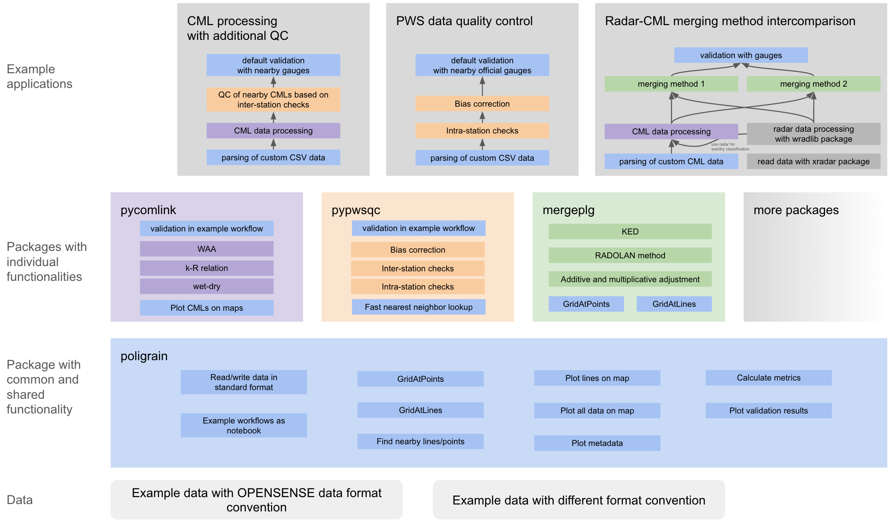

# Software Ecosystem Overview

## Architecture

The OpenSense software ecosystem follows a layered architecture designed for modularity and flexibility. At the foundation lies `poligrain` (for *po*int, *li*ne, *g*id *rain*fall data) which provides core functionalities common to processing and analyzing CML, SML, and PWS data. This foundational layer avoids interdependencies between processing packages that would occur if one package imported another to use specific implementations.

Above `poligrain` sit the specialized processing packages which are focused on specific sensor data or methods:
- `pycomlink` is designed for processing CML data, including quality control and rainfall estimation
- `pypwsqc` provides quality control and bias correction for PWS data
- `mergeplg` is a package for merging data from multiple sensors, including CMLs, PWSs, and SMLs.

For applications requiring multi-sensor processing or data merging, these packages are imported together with other specialized tools (e.g., wradlib for radar data).

{width="600px"}
*Figure: OpenSense software ecosystem architecture (from [Chwala et al., 2026](https://egusphere.copernicus.org/preprints/2026/egusphere-2025-5438/)).*

## Design Principles

The ecosystem leverages the OpenSense common standard for data and metadata structure in NetCDF files ([Fencl et al., 2023](https://pmc.ncbi.nlm.nih.gov/articles/PMC10884596/)), enabling:

- Simplified function calls with assumed data/metadata structure
- Automatic handling of geographic location information
- Integration with `xarray` for labeled multi-dimensional arrays

## Quick intro to the individual packages

Explore the individual packages through their intro notebooks below.
