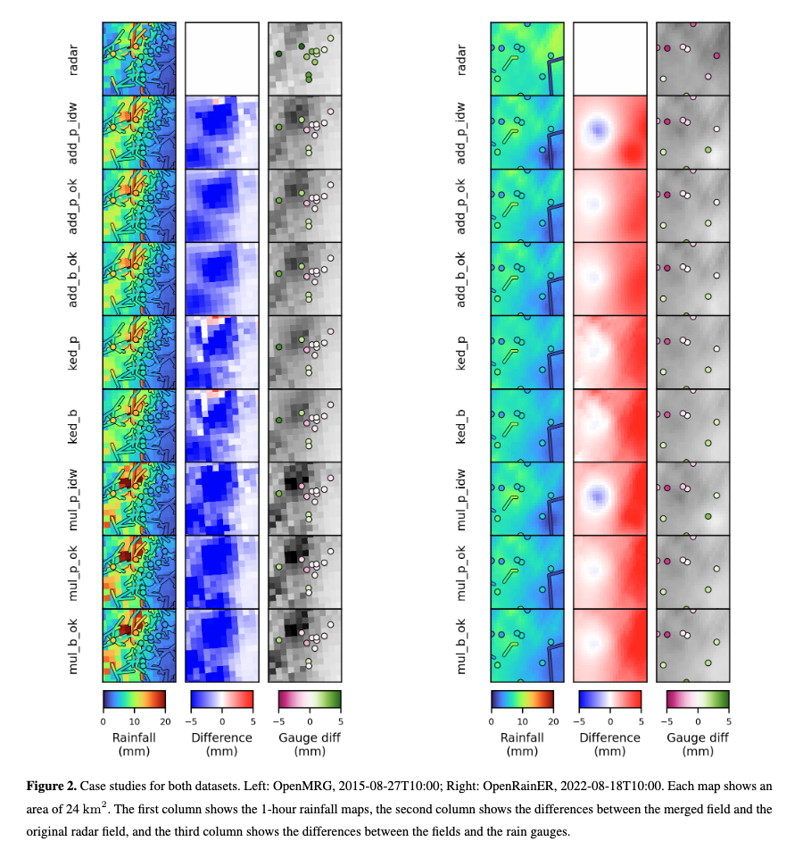

# Radar Merging Method Intercomparison

Intercomparison of different methods for merging radar rainfall data with CMLs using `mergeplg`.

In [Øydvin et al. (2025)](https://doi.org/10.5194/egusphere-2025-6371), we assessed the impact of merging commercial microwave link (CML) data with weather radar for quantitative precipitation estimation (QPE) using two openly available datasets (OpenMRG and OpenRainER) with contrasting observational densities. Multiple merging methods are compared, including kriging with external drift (KED) and a block kriging interpolation method that accounts for the line-average nature of CMLs.

Merging CML data improves radar QPE, with reductions in mean absolute error (MAE) of up to 38% on average for KED, though performance varies with rainfall intensity, distance to observations, and network density. 

The merging framework and intercomparison study are openly available at https://github.com/OpenSenseAction/radar_adjustment_intercomparison, enabling reproducibility and further exploration.

{width="600px"}
*Figure taken from [Øydvin et al. (2025)](https://doi.org/10.5194/egusphere-2025-6371); more details are available in the paper.*
